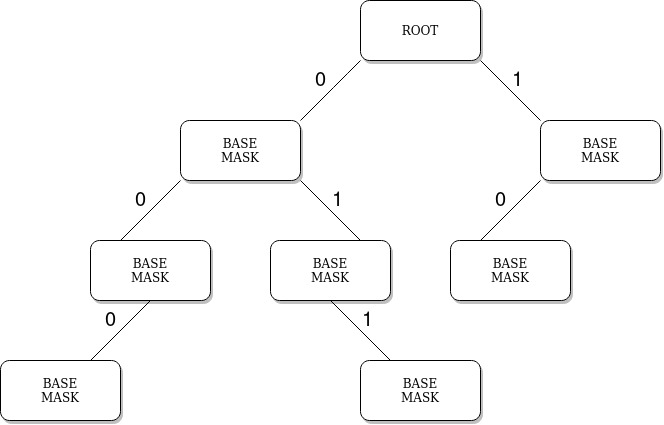
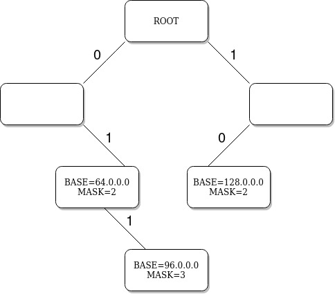

# IP PREFIX MANAGER

# Compiling

```sh
git submodule update --init
mkdir -p build
cd build
cmake ..
cmake --build .
```

### Requirements

* gcc
* cmake

# Testing

```sh
cd build
ctest -v
```


# Algorithm

Used data structure is trie which is known as prefix tree. 
In this structure every level of trie represents one bit of ip base address. The first 
level is the most significant bit, whereas the last one is the least. 
Root is a special case - it contains ip with mask equal to 0. Node holds within itself 
the value of ip only if it was added. Otherwise, the node is only a part of the structure
and not a storage for any ip address. 


**Structure of the trie**




**Example trie with filled values**



The example above is only for illustration. IP addresses are typically much longer than
in showed example.

The advantage of this particular trie is that its depth informs you about mask of the ip.
It also contains information about an ip base - by going through the trie it is possible 
to retrieve the ip base. In conclusion there is no need to store ip base and mask 
in particular node. Only needed information is location of the node in the trie, and a flag 
which notifies about the presence of ip in the node. It gives opportunity to save space.
